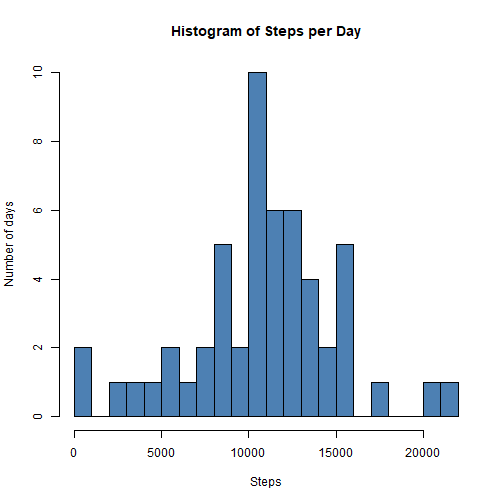
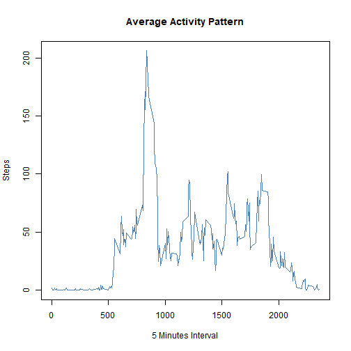
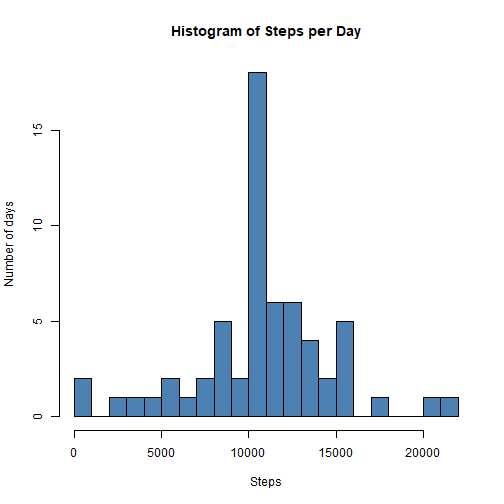

## Introduction

It is now possible to collect a large amount of data about personal movement using activity monitoring devices such as a Fitbit, Nike Fuelband, or Jawbone Up. These type of devices are part of the “quantified self” movement - a group of enthusiasts who take measurements about themselves regularly to improve their health, to find patterns in their behavior, or because they are tech geeks. But these data remain under-utilized both because the raw data are hard to obtain and there is a lack of statistical methods and software for processing and interpreting the data.

This assignment makes use of data from a personal activity monitoring device. This device collects data at 5 minute intervals through out the day. The data consists of two months of data from an anonymous individual collected during the months of October and November, 2012 and include the number of steps taken in 5 minute intervals each day.

## Data
The data for this assignment can be downloaded from the course web site:

Dataset: <a href="https://d396qusza40orc.cloudfront.net/repdata%2Fdata%2Factivity.zip">Activity monitoring data [52k]</a>
The variables included in this dataset are:

steps: Number of steps taking in a 5-minute interval (missing values are coded as NA)

date: The date on which the measurement was taken in YYYY-MM-DD format

interval: Identifier for the 5-minute interval in which measurement was taken

The dataset is stored in a comma-separated-value (CSV) file and there are a total of 17,568 observations in this dataset.


```r
# Download and unzip
library(ggplot2)
library(RColorBrewer)
library(dplyr)
library(lattice)

# Download and unzip the file
fileurl = 'https://d396qusza40orc.cloudfront.net/repdata%2Fdata%2Factivity.zip'
if (!file.exists('./Monitor Activity.zip')){
  download.file(fileurl,'./Monitor Activity.zip', mode = 'wb')
  unzip("Monitor Activity.zip")
}
Activity <- read.csv('./activity.csv', header = TRUE, sep = ',')
Activity$date <- as.Date(Activity$date, format="%Y-%m-%d")
head(Activity)
```

```
##   steps       date interval
## 1    NA 2012-10-01        0
## 2    NA 2012-10-01        5
## 3    NA 2012-10-01       10
## 4    NA 2012-10-01       15
## 5    NA 2012-10-01       20
## 6    NA 2012-10-01       25
```

```r
summary(Activity)
```

```
##      steps             date               interval     
##  Min.   :  0.00   Min.   :2012-10-01   Min.   :   0.0  
##  1st Qu.:  0.00   1st Qu.:2012-10-16   1st Qu.: 588.8  
##  Median :  0.00   Median :2012-10-31   Median :1177.5  
##  Mean   : 37.38   Mean   :2012-10-31   Mean   :1177.5  
##  3rd Qu.: 12.00   3rd Qu.:2012-11-15   3rd Qu.:1766.2  
##  Max.   :806.00   Max.   :2012-11-30   Max.   :2355.0  
##  NA's   :2304
```

#### 1. What is mean total number of steps taken per day?
#### 2. Calculate the total number of steps taken per day
#### 3. Calculate and report the mean and mean and median of the total number of steps taken per day


```r
aggAct <- aggregate(steps~date, Activity, sum)

hist(aggAct$steps, 
     main="Histogram of Steps per Day",
     xlab="Steps",
     ylab="Number of days",
     breaks=22,
     col=rgb(0.3, 0.5, 0.7))
```



```r
meanAct <- aggregate(steps~date, Activity, mean)
medianAct <- aggregate(steps~date, Activity, median)
# OR
sumStats <- tapply(aggAct$steps, aggAct$date, summary)
# Total Mean and Median
meanStepsT <- mean(aggAct$steps)
medianStepsT <- median(aggAct$steps)
```

#### 1. What is the average daily activity pattern?
#### 2. Which 5-minute interval, on average across all the days in the dataset, contains the maximum number of steps?


```r
# Plot Histogram of daily averages for 5-minute intervals
avgDailyAct <- aggregate(steps~interval, Activity, mean)
plot(avgDailyAct$interval, 
     avgDailyAct$steps, 
     type="l", 
     col=rgb(0.3, 0.5, 0.7),
     xlab="5 Minutes Interval",
     ylab="Steps",
     main="Average Activity Pattern")
```



```r
maxInterval <- avgDailyAct[avgDailyAct$steps %in% max(avgDailyAct$steps),]
maxInterval
```

```
##     interval    steps
## 104      835 206.1698
```

#### 1. Impute missing values
#### 2. Calculate and report the total number of missing values in the dataset
#### 3. Create new dataset equal to original dataset with missing data filled in
#### 4. Make a histogram of total number of steps taken each day, and calculate and report the mean and median total number of steps taken per day. 
#### 5. Do these differ from the estimates from the first part of the assignment?
#### 6. What is the impact of imputing missing data on the estimates?


```r
# How many Na's
length(which(is.na(Activity)))
```

```
## [1] 2304
```

```r
# Imputing missing values
NARows <- NA
NARows <- which(is.na(Activity$steps))

mergeThis <- data.frame(Activity$date[NARows], Activity$interval[NARows])
colnames(mergeThis) <- c("date", "interval")
copyV <- inner_join(avgDailyAct, mergeThis, by="interval")

newDataset <- na.omit(Activity)
copyV <- rbind(newDataset, copyV)

copyAgg <- aggregate(steps~date, copyV, sum)
hist(copyAgg$steps, 
     main="Histogram of Steps per Day",
     xlab="Steps",
     ylab="Number of days",
     breaks=22,
     col=rgb(0.3, 0.5, 0.7))
```



```r
# Total Mean and Median on imputed
meanStepsT <- mean(copyAgg$steps)
medianStepsT <- median(copyAgg$steps)

meanStepsT
```

```
## [1] 10766.19
```

```r
medianStepsT
```

```
## [1] 10766.19
```


#### 1. Are there differences in activity patterns between weekdays and weekends?

```r
copyV$date <- as.Date(copyV$date)
copyV$dayWeek <- weekdays(copyV$date)

copyV$weekend <- "Weekday"
copyV$weekend[copyV$dayWeek %in% c("Saturday", "Sunday")] <- "Weekend"
copyV$weekend <- as.factor(copyV$weekend)

copyAgg <- aggregate(steps~interval+weekend, data=copyV, FUN=mean)
xyplot(steps ~ interval | weekend, data=copyAgg, type="l", layout=c(1,2))
```


##### It seems there is a huge spike in one place during the weekdays, after which people don't move as much. This can correspond to them starting their daily 9-5 jobs, after which only unemployed people (underage, students, elderly) are the people creating the movement. If it's one person - it might mean that they need to be moving and have some type of field work, but not as much as during the Weekend where after the initial (supposedly morning) spike, there is still a lot of movement throughout all intervals.
